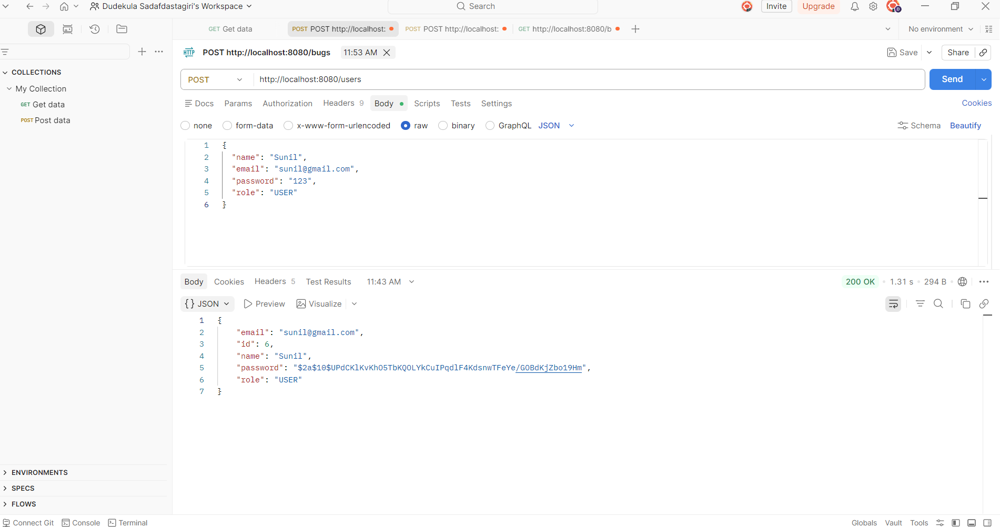
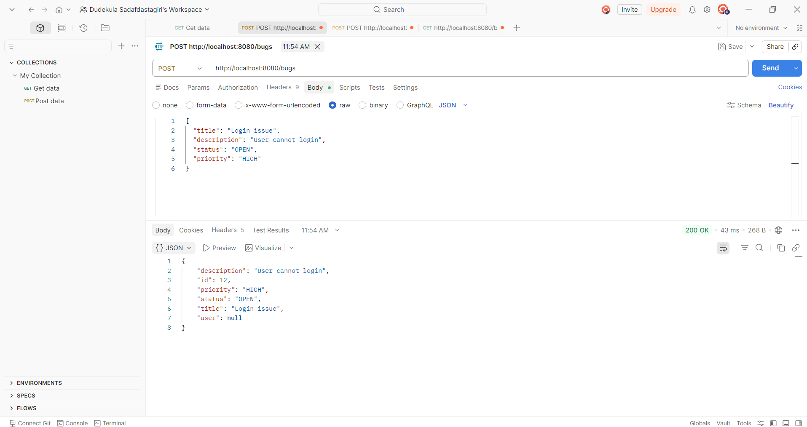
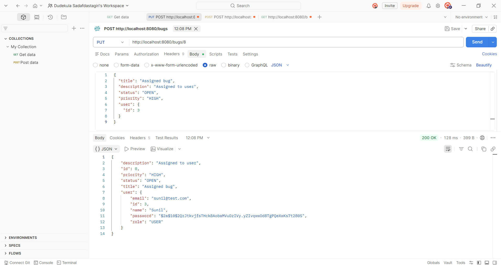
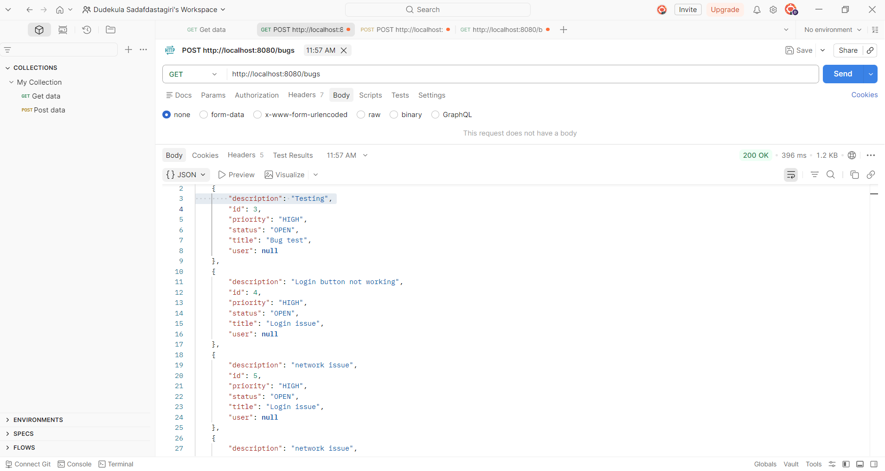
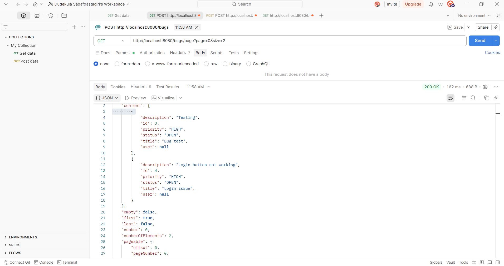
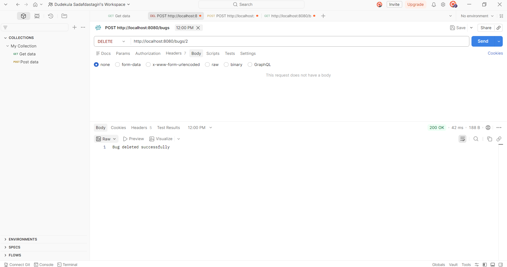

Bug Tracker Application

Features
- Create, Update, Delete Bugs
- Pagination support
- Assign bugs to users
- REST APIs tested using Postman

Tech Stack
- Java
- Spring Boot
- Spring Data JPA
- MySQL
- Maven

Description
This is a backend application to track bugs and assign them to users. It supports CRUD operations, pagination, and user-bug relationship using JPA.

Run Project
- Clone repository
- Run: mvn spring-boot:run

API Testing
- Use Postman to test APIs (GET, POST, PUT, DELETE)
  
API Execution Screenshots

### Create User

### Create Bug

### Assign User

### Get Bugs

### Pagination

### Delete Bug

